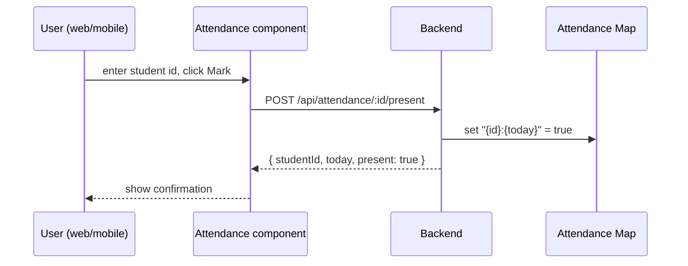

# SchoolAdmin — Design Overview

This document describes the current architecture, data model, API surface, component responsibilities, and recommended improvements for the SchoolAdmin monorepo.

## Projects
- Backend: [Backend/src/index.js](Backend/src/index.js#L1-L20) — Express API exposing attendance endpoints.
- Website: [website/src](website/src) — Vite + React web UI that calls the backend.
- Mobile: [mobileApp](mobileApp) — React Native stub with a simple Attendance component.

## High-level architecture

```mermaid
flowchart LR
  Browser[Website UI]
  Mobile[Mobile App]
  Browser -->|HTTP POST /api/attendance/:id/present| Backend(API)
  Mobile -->|HTTP POST /api/attendance/:id/present| Backend(API)
  Backend(API) -->|SQL| AttendanceStore[(SQLite DB)]
  note right of AttendanceStore: persistent storage stores
  note right of AttendanceStore: attendance per student per date
```

## API surface

- POST `/api/attendance/:id/present` — mark student `id` present for today. (see [Backend/src/routes.js](Backend/src/routes.js#L1-L40))
- GET `/api/attendance/:id` — get today's presence for `id`.

Request/response (current): JSON payloads. No authentication, no validation beyond presence of ID.

## Data model

- Attendance key: `"{studentId}:{YYYY-MM-DD}"` → boolean `true` when present (see [Backend/src/controllers/attendance.js](Backend/src/controllers/attendance.js#L1-L40)).

Limitations of current model:
- In-memory Map is ephemeral — will not survive process restart.
- No student entity model (name, class, id validation).
- No timestamps for who marked present or when beyond date.

## UI components

- Website `Attendance` component: [website/src/components/Attendance.jsx](website/src/components/Attendance.jsx#L1-L60)
  - Provides an input for `student-id` and a `Mark Present` button.
  - Calls `markPresent` in [website/src/api/attendance.js](website/src/api/attendance.js#L1-L40).

- Mobile `Attendance` component: `mobileApp/components/Attendance.js` — placeholder for mobile UI.

## Sequence: Mark Present



## Recommended design changes (short-term)

1. Persist attendance: replace in-memory Map with a small datastore (Postgres/SQLite). Add migration and model `Attendance(student_id, date, present, marked_by, marked_at)`.
2. Add student management: `Student(id, name, grade)` and validation endpoints.
3. Add basic auth for API (JWT or session) and role-based access (teacher/admin).
4. Improve error handling and input validation in API routes.
5. Add integration tests that run website + backend (supertest + jsdom/vitest) in CI.

## Recommended design changes (long-term / features)

- Bulk attendance upload (CSV), per-class views, reporting (attendance %), export to CSV.
- Offline support for mobile (store actions locally and sync when online).
- Audit log: who marked present and when.

## Repository TODOs (suggested)

- [x] Persist attendance to DB and add migration scripts.
- [x] Add `Student` entity + CRUD endpoints and UI.
- [x] Add `Teacher` entity + CRUD endpoints.
- [x] Add `Class` and `Enrollment` entities + CRUD endpoints.
- [ ] Add authentication and protect endpoints.
- [ ] Implement proper error messages and input validation.
- [ ] Implement mobile UI parity with website and network error handling.
- [ ] Add CI pipeline to run tests for all subprojects.

## Where to start (implementation plan)

1. Add a database (SQLite for quick dev), implement `Attendance` model and replace Map usage. Update tests.
2. Add `Student` model and endpoints; adjust UI to validate IDs and show names.
3. Add authentication (simple dev JWT) and protect `POST` endpoint.
4. Improve UI and add tests covering end-to-end flows.

## Notes & references

- Quick wins: persist store + add student model will remove the biggest limitation.
- Current runnable commands are in [README.md](README.md#L1-L40).

---
Created by automated repo scan. Ask which area you'd like prioritized and I will implement the first change.

## Full School Administration Scope

This project will grow from an attendance tool into a full School Administration System (SIS). Key capabilities to include:

- Core entities: `Student`, `Teacher`, `User` (auth), `Class`/`Course`, `Enrollment`, `Attendance`, `Grade`, `Timetable`, `Room`, `Term`.
- Admin features: user/role management, class scheduling, reporting (attendance %, gradebooks), bulk imports/exports, and audit logs.
- Integrations: email notifications, CSV import/export, optional LMS or SIS sync.

### Domain model (ERD)

```mermaid
erDiagram
  STUDENT ||--o{ ENROLLMENT : enrolls
  CLASS ||--o{ ENROLLMENT : has
  TEACHER ||--o{ CLASS : teaches
  CLASS ||--o{ ATTENDANCE : records
  STUDENT ||--o{ ATTENDANCE : has
  STUDENT ||--o{ GRADE : receives
  CLASS ||--o{ GRADE : contains
  USER ||--o{ CLASS : manages
```

### MVP boundary (what to deliver first)

1. Persistent storage + migrations (SQLite dev, Postgres production-ready schema).  
2. Authentication and RBAC (Admin, Teacher, Staff).  
3. Student CRUD + Class management + Enrollment flows.  
4. Attendance recording (web + mobile) persisted to DB + simple reports.  
5. Basic grade entry and per-class gradebook.

### API surface (examples)

- Auth: `POST /api/auth/login`, `POST /api/auth/refresh`  
- Users: `GET/POST/PUT/DELETE /api/users`  
- Students: `GET/POST/PUT/DELETE /api/students`  
- Teachers: `GET/POST/PUT/DELETE /api/teachers`  
- Classes: `GET/POST/PUT/DELETE /api/classes`  
- Enrollments: `POST /api/classes/:id/enroll`, `GET /api/students/:id/enrollments`  
- Attendance: `POST /api/attendance/:studentId/present`, `GET /api/attendance/:studentId?from=&to=`  
- Grades: `POST /api/classes/:id/grades`, `GET /api/students/:id/grades`  

All write endpoints require auth; restrict by role where appropriate (teachers can mark attendance for their classes, admins can manage users).

### UI surface (initial pages)

- Landing / Dashboard (overview widgets: today's attendance, upcoming classes).  
- Students list + detail + create/edit.  
- Classes list + schedule + enrollment.  
- Attendance quick-mark screen (search student, scan ID, bulk mark).  
- Gradebook per class.  
- Admin: Users & roles, Reports, Settings.

### Data storage & choices

- Use SQLite with `knex` or `sequelize` for quick dev, with Postgres-compatible migrations for production.  
- Store audit logs for critical actions (who marked attendance, when).  
- Consider indexing by date for fast attendance queries.

### Next practical step (recommended)

Start by implementing the DB layer and `Student` entity: migration, model, CRUD API, and UI list/detail pages. This will provide a foundation for enrollments, attendance, and grading.

If you agree, I will implement the first step: add SQLite via `better-sqlite3` or `knex` migrations and create `students` table with tests and API endpoints.
