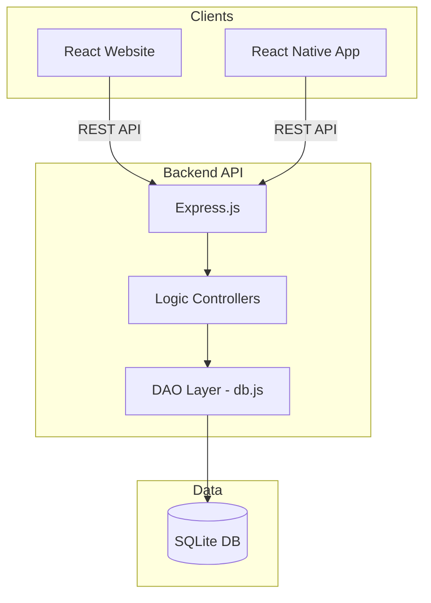

# SchoolAdmin Architecture

This document provides a comprehensive overview of the SchoolAdmin system's architecture, including its components, technology stack, data model, and API design.

## 1. System Overview

SchoolAdmin is a monorepo-based School Administration System (SIS) designed to manage student and teacher records, class enrollments, academic planning, and attendance tracking. It consists of a centralized backend API, a web application for administrators and teachers, and a mobile application for mobile-first attendance and record management.

### Monorepo Structure
- **Backend/**: Node.js Express API.
- **website/**: React web application (Vite).
- **mobileApp/**: React Native mobile application.

---

## 2. Technology Stack

### Backend
- **Runtime**: Node.js
- **Framework**: Express.js
- **Database**: SQLite (managed via `better-sqlite3`)
- **DAO Pattern**: High-performance implementation in `db.js` using **Prepared Statements** for all CRUD operations.
- **Migrations**: Schema initialized via `CREATE TABLE IF NOT EXISTS` in `db.js`. Knex.js remains in the project for future complex migrations.
- **Authentication**: JWT-based (stateless) with a **Triple-Layer Middleware** stack:
    - `authenticate`: JWT validation using `jsonwebtoken`.
    - `authorize(permission)`: Granular RBAC checks against a role-permission mapping.
    - `isAdmin`: Strict administrative access guard.
- **Security**: Password hashing via `bcryptjs`.
- **Testing**: Jest and Supertest.

### Frontend (Website)
- **Framework**: React 18
- **Build Tool**: Vite
- **Routing**: React Router v6
- **Architecture**: Domain-driven component structure with modules for Students, Teachers, and **Academic Planning**.
- **Styling**: Vanilla CSS.
- **Testing**: Vitest.

### Mobile (App)
- **Framework**: React Native (Expo/Vanilla)
- **Navigation**: Custom **State-Driven Navigation** pattern in `App.js` (using React state to switch between screens).
- **State Management**: React Hooks (useState/useEffect).
- **Testing**: Jest.

---

## 3. High-Level Architecture

The system follows a standard Client-Server architecture.



---

## 4. Data Model

The database schema is designed to handle core school entities and their relationships.

### Core Entities (Implemented)
- **Sections**: Top-level hierarchy (e.g., Nursery, Primary, JSS, SSS).
- **Students**: Profiles with metadata (JSON), admission numbers, and status.
- **Teachers**: Profiles with staff IDs, qualifications, and status.
- **Classes**: Grade levels assigned to sections and teachers.
- **Subjects**: Academic subjects with codes and categories.
- **Academic Periods**: Terms and academic years with start/end dates.
- **Schedules**: Weekly timetable/timings linking classes, teachers, and subjects.
- **Users**: Authentication accounts with roles (`admin`, `teacher`, `staff`).

### Join Entities & Records
- **Enrollments**: Many-to-Many relationship between Students and Classes.
- **Attendance**: Daily records (per student/class/day) of presence.

### Planned Features (Future)
- **Audit Logs**: System-wide tracking of administrative and security-sensitive actions.
- **User Sessions**: Management of active login sessions and refresh tokens.

### ERD (Entity Relationship Diagram)
```mermaid
erDiagram
    STUDENT ||--o{ ENROLLMENT : enrolls
    CLASS ||--o{ ENROLLMENT : has
    TEACHER ||--o{ CLASS : teaches
    CLASS ||--o{ ATTENDANCE : records
    STUDENT ||--o{ ATTENDANCE : has
    CLASS ||--o{ SCHEDULE : follows
    TEACHER ||--o{ SCHEDULE : assigned_to
    SUBJECT ||--o{ SCHEDULE : belongs_to
    USER ||--o| STUDENT : "linked to (planned)"
    USER ||--o| TEACHER : "linked to (planned)"
    USER }|--|| ROLE : has
```

---

## 5. API Design

The Backend exposes a RESTful API under the `/api` prefix.

### Key Endpoint Groups
- **/api/auth**: `register`, `login`.
- **/api/students**: Full CRUD + list.
- **/api/teachers**: Full CRUD + list.
- **/api/classes**: Full CRUD + Enrollment management (`/enroll`, `/unenroll`, `/students`).
- **/api/attendance**: Mark present (`/:id/present`), retrieve status (`/:id`).
- **/api/planning**: 
    - `/periods`: List/Create academic periods.
    - `/subjects`: List/Create subjects.
    - `/schedules`: Create/Delete/Get class-wise schedules.

### Security & RBAC
- **Authentication**: Bearer Token (JWT) required for protected routes.
- **Authorization**: The `authorize(permission)` middleware uses a hardcoded mapping (to be moved to DB):
    - `admin`: Full access to all routes.
    - `teacher`: `attendance:mark`, `student:list`.
    - `staff`: `attendance:mark`, `student:list`, `student:create`.

---

## 6. Development Workflow

1. **Environment Setup**: Define `DB_FILE` and `JWT_SECRET` in `.env`.
2. **Database Initialization**: Run `npm run migrate` (triggers `db.init()`).
3. **Seeding**: Currently manual via API or DB browser.
4. **Testing**:
   - Backend: `npm test` runs Jest.
   - Website: `npm test` runs Vitest.
   - Mobile: `npm test` runs Jest.
